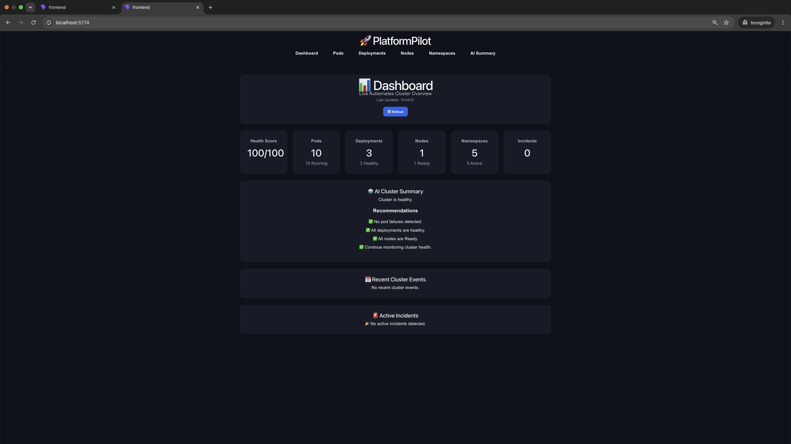
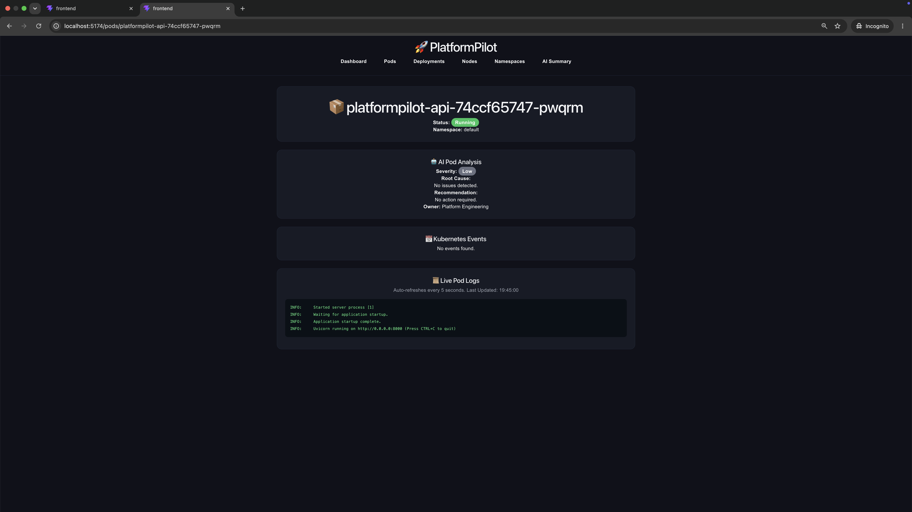
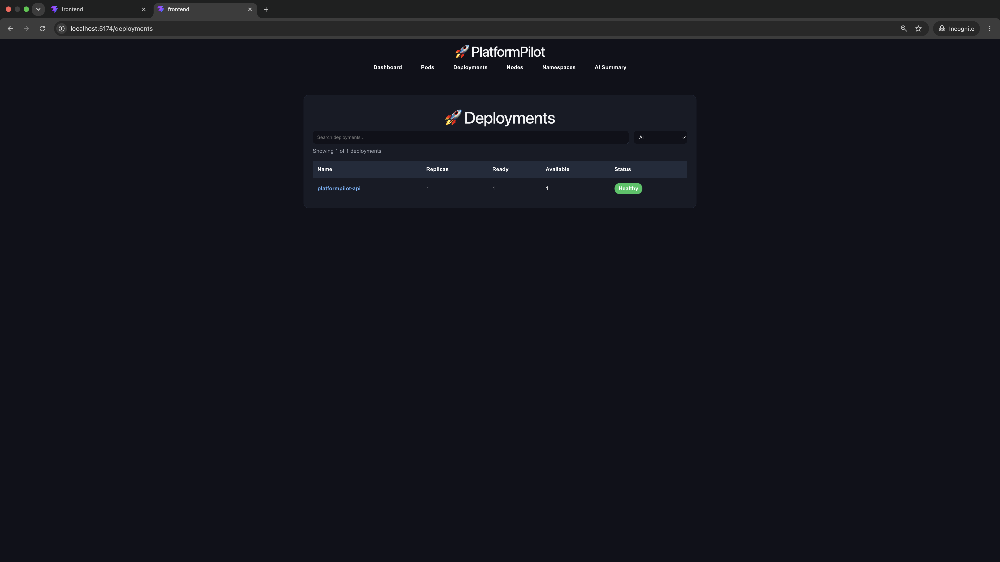
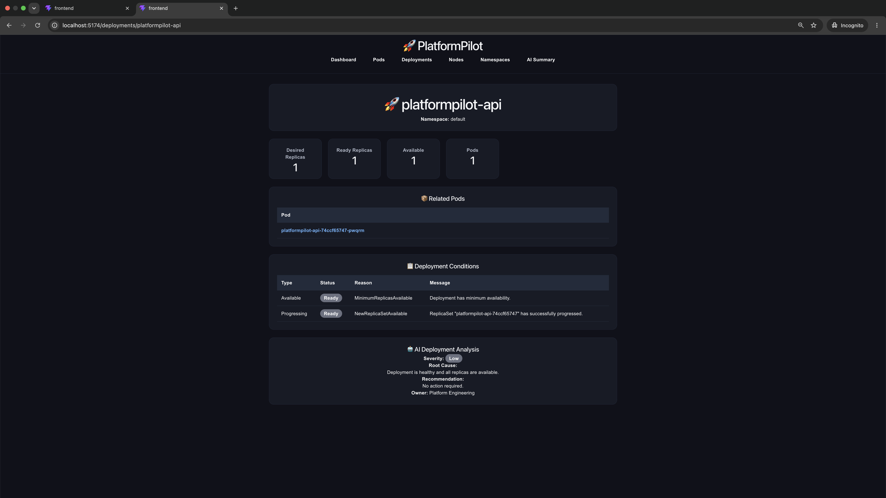
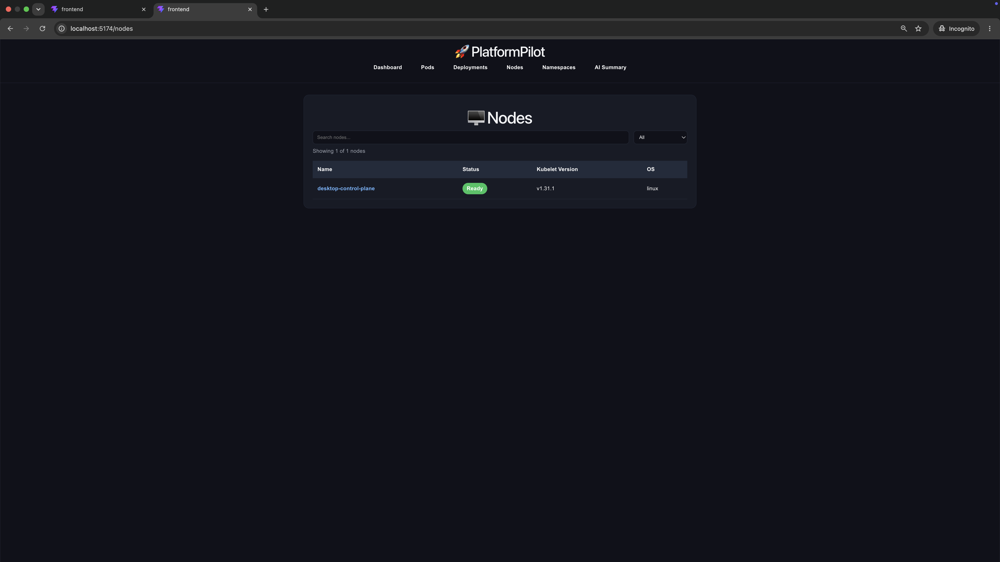
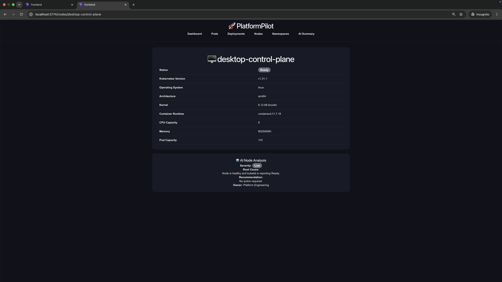
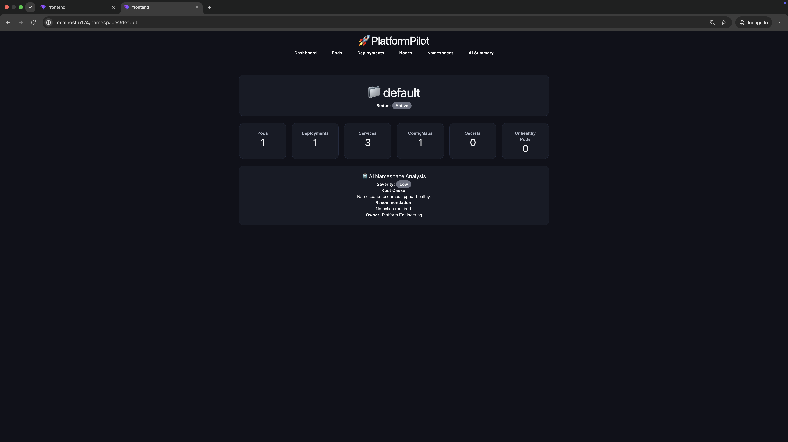

# 🚀 PlatformPilot

PlatformPilot is an AI-powered Kubernetes Operations Dashboard built with **React**, **FastAPI**, and the **Kubernetes Python Client**.

It provides a modern interface for monitoring Kubernetes clusters, inspecting workloads, and generating AI-assisted operational insights.

---
## 📸 Screenshots

### Dashboard



### Pods



### Pod Details


### Deployments



### Deployment Details



### Nodes



### Node Details



### Namespace Details


---

# ✨ Features

## 📊 Cluster Dashboard

- Health Score
- AI Cluster Summary
- Active Incidents
- Recent Kubernetes Events
- Recommendations
- Live Auto Refresh
- Manual Refresh

---

## 📦 Pods

- List Pods
- Search Pods
- Filter by Status
- Pod Details
- Live Pod Logs
- Kubernetes Events
- AI Analysis

---

## 🚀 Deployments

- List Deployments
- Search Deployments
- Health Filter
- Deployment Details
- Replica Status
- Conditions
- AI Recommendations

---

## 🖥 Nodes

- List Nodes
- Search Nodes
- Ready Filter
- Node Details
- Capacity
- Allocatable Resources
- AI Health Analysis

---

## 📁 Namespaces

- List Namespaces
- Search Namespaces
- Status Filter
- Namespace Details
- Resource Counts
- AI Summary

---

# 🛠 Tech Stack

## Frontend

- React
- React Router
- CSS3
- Fetch API

## Backend

- FastAPI
- Kubernetes Python Client
- Uvicorn

## Kubernetes

- Docker Desktop Kubernetes
- kubectl

---

# 📂 Project Structure

```
platform-pilot/

backend/
    app.py
    ai.py
    kubernetes_client.py

frontend/
    src/
        components/
        pages/
        services/

README.md
```

---

# 🚀 Getting Started

## Clone

```bash
git clone https://github.com/AZ1600/platform-pilot.git

cd platform-pilot
```

---

## Backend

```bash
cd backend

python -m venv venv

source venv/bin/activate

pip install -r requirements.txt

uvicorn app:app --reload
```

---

## Frontend

```bash
cd frontend

npm install

npm run dev
```

---

## Open

```
Frontend

http://localhost:5173

Backend

http://localhost:8000
```

---

# 📈 Roadmap

- [x] Dashboard
- [x] Pod Monitoring
- [x] Deployment Monitoring
- [x] Node Monitoring
- [x] Namespace Monitoring
- [x] AI Recommendations
- [x] Live Pod Logs
- [x] Search & Filtering
- [ ] Charts
- [ ] Prometheus Metrics
- [ ] WebSocket Live Updates
- [ ] Multi-Cluster Support
- [ ] Authentication

---

# 🤖 AI Features

PlatformPilot uses AI-assisted analysis to provide:

- Root Cause Analysis
- Severity Classification
- Recommended Actions
- Suggested Owner

---

# 📄 License

MIT

---

# 👨‍💻 Author

**Olawale Azeez**

GitHub:

https://github.com/AZ1600