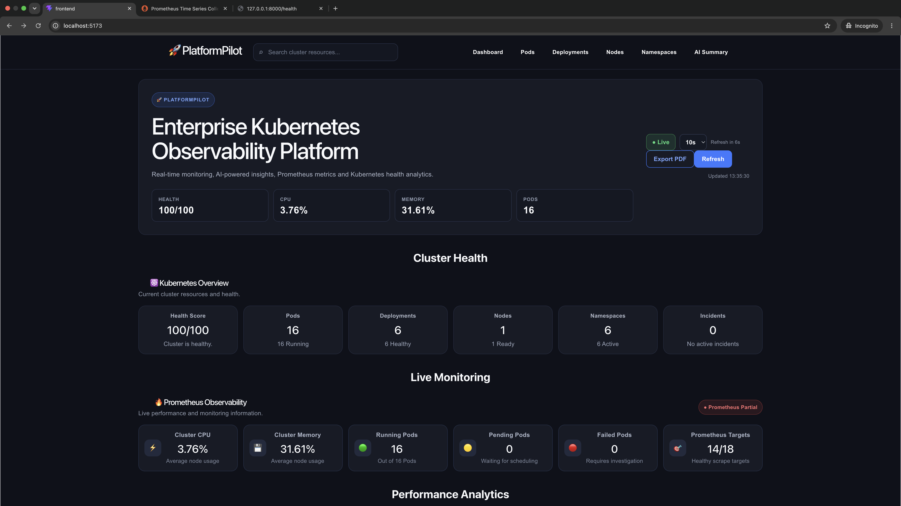
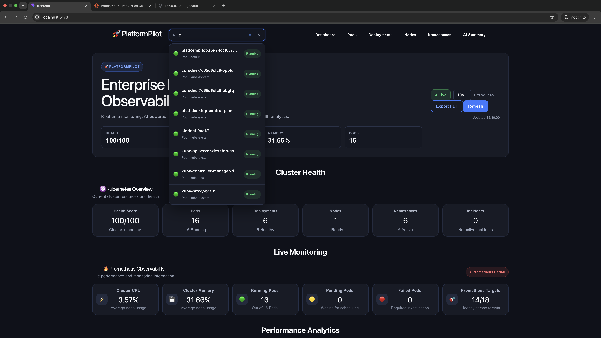
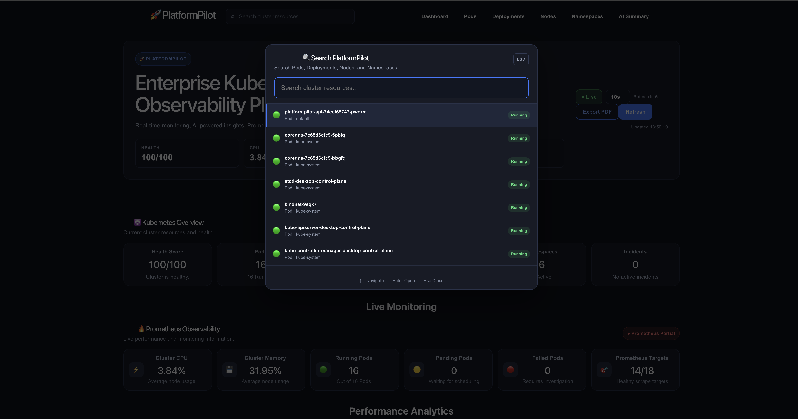
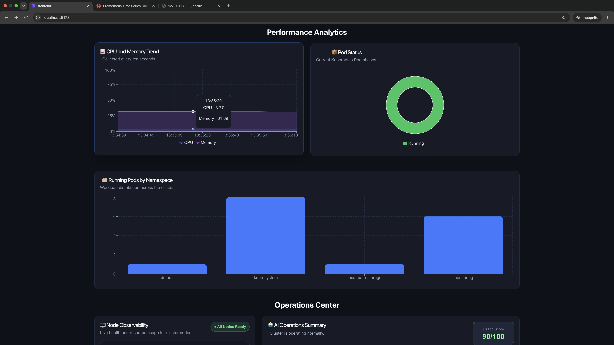
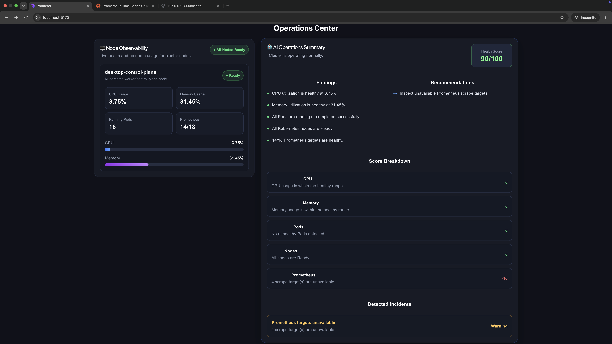
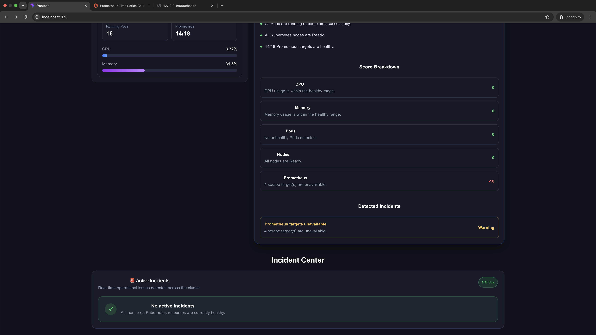
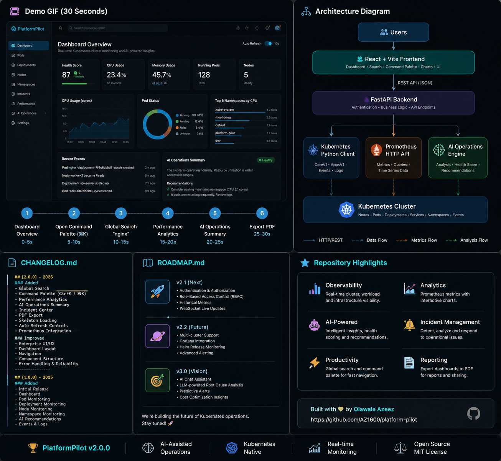

# 🚀 PlatformPilot

> **An AI-assisted Kubernetes Observability Platform for monitoring cluster health, analyzing workloads, and accelerating incident response.**

PlatformPilot combines Kubernetes APIs, Prometheus metrics, and AI-powered operational insights into a modern dashboard designed for Platform Engineers, DevOps Engineers, and Site Reliability Engineers.

<p align="center">
  
</p>

---


---

# 📖 Overview

PlatformPilot is an AI-assisted Kubernetes operations dashboard built with **React**, **FastAPI**, and the **Kubernetes Python Client**.

The platform provides real-time visibility into Kubernetes workloads, cluster infrastructure, performance metrics, and operational health while using AI-powered analysis to help engineers identify issues faster and make informed operational decisions.

---

# ✨ Highlights

- 🚀 Enterprise Kubernetes Observability Dashboard
- 🤖 AI-assisted Operations Summary
- 📊 Live Prometheus Monitoring
- 🔍 Global Search Across Kubernetes Resources
- ⌨️ Keyboard-driven Command Palette (Ctrl+K / ⌘K)
- 🚨 Incident Detection & Health Scoring
- 📄 PDF Report Export
- ⚡ Auto Refresh

---

# ✨ Features

## 📊 Cluster Observability

- Overall Cluster Health Score
- Live Monitoring Dashboard
- Real-time Kubernetes Metrics
- Prometheus Health Monitoring
- Manual & Automatic Refresh
- Export Dashboard as PDF

---

## 🤖 AI Operations

- AI Operations Summary
- Cluster Health Analysis
- Operational Recommendations
- Root Cause Analysis
- Severity Classification
- Incident Detection

---

## 📈 Performance Analytics

- CPU & Memory Trends
- Pod Status Distribution
- Namespace Workload Analytics
- Resource Utilization
- Prometheus Metrics

---

## 🔍 Productivity

- Global Resource Search
- Command Palette (Ctrl+K / ⌘K)
- Keyboard Navigation
- Fast Resource Discovery
- Search Pods, Deployments, Nodes & Namespaces

---

# 🏗 Architecture

```text
                 React Frontend
                        │
                        ▼
                 FastAPI Backend
                        │
        ┌───────────────┴───────────────┐
        ▼                               ▼
 Kubernetes Python Client        Prometheus Metrics
        │                               │
        └───────────────┬───────────────┘
                        ▼
                Kubernetes Cluster
```

---

# 🛠 Technology Stack

## Frontend

- React 19
- React Router
- Vite
- CSS3

## Backend

- FastAPI
- Python 3.12
- Kubernetes Python Client
- Uvicorn

## Infrastructure

- Kubernetes
- Prometheus
- Docker Desktop
- kubectl

---

# 📂 Project Structure

```text
platform-pilot/
│
├── backend/
├── frontend/
├── infrastructure/
├── screenshots/
│   ├── dashboard-overview.png
│   ├── global-search.png
│   ├── command-palette.png
│   ├── performance-analytics.png
│   ├── ai-operations-summary.png
│   └── incident-center.png
│
├── CHANGELOG.md
├── CONTRIBUTING.md
├── LICENSE
├── README.md
└── .gitignore
```

---

# 📸 Screenshots

## 🚀 Dashboard Overview

The main dashboard provides a centralized view of cluster health, live monitoring, AI insights, and operational metrics.


---

## 🔍 Global Search

Search Kubernetes resources instantly across Pods, Deployments, Nodes, and Namespaces.



---

## ⌨️ Command Palette

Quickly navigate the platform using the keyboard-driven Command Palette (**Ctrl+K / ⌘K**).



---

## 📈 Performance Analytics

Visualize CPU usage, memory consumption, pod status, and namespace workload distribution through real-time charts.



---

## 🤖 AI Operations Summary

Receive AI-generated operational insights, health scoring, findings, and recommended actions.



---

## 🚨 Incident Center

Track cluster incidents, operational alerts, and active health issues from a centralized dashboard.



---

# 🌟 PlatformPilot Project Overview

This infographic summarizes PlatformPilot's architecture, roadmap, repository highlights, and upcoming features.


---

# 🚀 Getting Started

## Clone the Repository

```bash
git clone https://github.com/AZ1600/platform-pilot.git

cd platform-pilot
```

---

## Backend Setup

```bash
cd backend

python -m venv venv

# Linux / macOS
source venv/bin/activate

# Windows
venv\Scripts\activate

pip install -r requirements.txt

uvicorn app:app --reload
```

Backend:

```
http://localhost:8000
```

---

## Frontend Setup

```bash
cd frontend

npm install

npm run dev
```

Frontend:

```
http://localhost:5173
```

---

# 📈 Roadmap

## ✅ Completed

- Enterprise Dashboard
- AI Operations Summary
- Performance Analytics
- Prometheus Integration
- Global Search
- Command Palette
- Incident Center
- PDF Export
- Auto Refresh
- Responsive UI

---

## 🚀 Planned

- Authentication
- Role-Based Access Control (RBAC)
- Multi-cluster Support
- Historical Metrics
- WebSocket Live Updates
- Grafana Integration
- Helm Monitoring
- LLM-powered Root Cause Analysis

---

# 💡 Use Cases

PlatformPilot enables engineers to:

- Monitor Kubernetes cluster health
- Analyze workload performance
- Search Kubernetes resources instantly
- Detect operational incidents
- Troubleshoot infrastructure issues
- Visualize Prometheus metrics
- Accelerate incident response using AI
- Improve Kubernetes operational visibility

---

# 🤝 Contributing

Contributions, issues, and feature requests are welcome.

Please read **CONTRIBUTING.md** before opening a pull request.

---

# 📄 License

This project is licensed under the MIT License. See the **LICENSE** file for more information.

---

# 👨‍💻 Author

**Olawale Azeez**

GitHub: https://github.com/AZ1600

---

<p align="center">
⭐ If you found PlatformPilot useful, consider giving the repository a star!
</p>