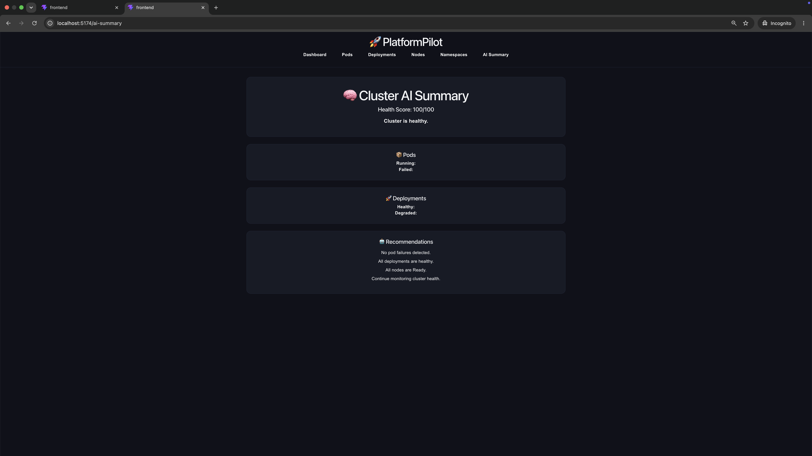

# 🚀 PlatformPilot

An AI-assisted Kubernetes Operations Dashboard built with **React**, **FastAPI**, and the **Kubernetes Python Client**.

PlatformPilot provides a modern web interface for monitoring Kubernetes clusters, inspecting workloads, analyzing cluster health, and accelerating troubleshooting through intelligent operational insights.

---


---

# 📖 Overview

PlatformPilot is an AI-assisted Kubernetes operations dashboard designed for Platform Engineers, DevOps Engineers, and Site Reliability Engineers.

The application communicates directly with the Kubernetes API to provide real-time visibility into cluster resources, workload health, deployments, nodes, namespaces, and operational events. It also performs intelligent analysis to help engineers identify issues and recommended actions more quickly.

---

# ✨ Features

## 📊 Cluster Dashboard

- Overall Cluster Health Score
- AI Cluster Summary
- Cluster Recommendations
- Active Incident Detection
- Recent Kubernetes Events
- Manual Refresh
- Automatic Refresh (Every 10 Seconds)

---

## 📦 Pod Monitoring

- View Running Pods
- Search Pods
- Filter by Status
- Detailed Pod Inspection
- Kubernetes Events
- Live Container Logs
- AI Root Cause Analysis
- Severity Classification
- Operational Recommendations

---

## 🚀 Deployment Monitoring

- List Deployments
- Search Deployments
- Health Filtering
- Replica Status
- Deployment Conditions
- Related Pods
- AI Deployment Analysis

---

## 🖥 Node Monitoring

- List Cluster Nodes
- Search Nodes
- Ready Status Filter
- Capacity & Allocatable Resources
- Container Runtime Information
- Kubernetes Version
- AI Node Health Analysis

---

## 📁 Namespace Monitoring

- List Namespaces
- Search Namespaces
- Status Filtering
- Namespace Resource Summary
- Resource Counts
- Healthy & Unhealthy Pods
- AI Namespace Analysis

---

# 🤖 AI Features

PlatformPilot performs intelligent operational analysis and provides:

- Root Cause Analysis
- Severity Classification
- Recommended Actions
- Suggested Owner
- Cluster Health Summary

---

# 🏗 Architecture

```
                    React Frontend
                           │
                           ▼
                    FastAPI Backend
                           │
                           ▼
             Kubernetes Python Client
                           │
                           ▼
                  Kubernetes Cluster
```

---

# 🛠 Technology Stack

## Frontend

- React
- React Router
- CSS3
- Fetch API
- Vite

---

## Backend

- FastAPI
- Python
- Kubernetes Python Client
- Uvicorn

---

## Kubernetes

- Docker Desktop Kubernetes
- kubectl
- Kubernetes API

---

# 📂 Project Structure

```
platform-pilot/
│
├── backend/
│   ├── app.py
│   ├── ai.py
│   ├── kubernetes_client.py
│   ├── requirements.txt
│
├── frontend/
│   ├── src/
│   │   ├── components/
│   │   ├── pages/
│   │   ├── services/
│   │   └── App.jsx
│   │
│   ├── package.json
│   └── vite.config.js
│
├── screenshots/
│   ├── dashboard.png
│   ├── ai-summary.png
│   ├── pods.png
│   ├── pod-details.png
│   ├── deployments.png
│   ├── deployment-details.png
│   ├── nodes.png
│   ├── node-details.png
│   └── namespace-details.png
│
├── COMMANDS.md
├── README.md
└── .gitignore
```

---

# 📸 Screenshots

## 📊 Dashboard

The Dashboard provides a centralized view of the Kubernetes cluster, displaying the overall health score, resource counts, AI-generated recommendations, recent cluster events, and active incidents. It serves as the primary landing page for monitoring cluster health.


---

## 🤖 AI Cluster Summary

The AI Summary page presents an intelligent overview of the Kubernetes environment by analyzing the health of cluster resources and highlighting operational recommendations. This allows engineers to quickly understand the overall state of the cluster without manually inspecting every workload.



---

## 📦 Pods

The Pods page lists all workloads running within the cluster. Users can search by pod name or namespace, filter workloads by status, and quickly identify pods that require investigation.


---

## 📦 Pod Details

The Pod Details page provides comprehensive information about an individual pod, including Kubernetes events, live container logs, and AI-assisted root cause analysis with severity classification and operational recommendations.


---

## 🚀 Deployments

The Deployments page displays every deployment running within the Kubernetes cluster. Engineers can search deployments, monitor replica health, and quickly identify workloads that are degraded or unavailable.


---

## 🚀 Deployment Details

The Deployment Details page displays deployment metadata, replica status, deployment conditions, related pods, and AI-generated health analysis to assist with deployment troubleshooting and operational decision making.


---

## 🖥 Nodes

The Nodes page provides a high-level overview of every Kubernetes node, including readiness status, operating system, Kubernetes version, and quick filtering capabilities for cluster infrastructure monitoring.


---

## 🖥 Node Details

The Node Details page displays detailed infrastructure information such as CPU capacity, memory allocation, container runtime, kernel version, and AI-generated health recommendations to help engineers assess node health.


---

## 📁 Namespace Details

The Namespace Details page summarizes all Kubernetes resources within a namespace, including pods, deployments, services, ConfigMaps, secrets, unhealthy workloads, and AI-generated operational insights to provide a complete overview of namespace health.


---

# 🚀 Getting Started

## Clone the Repository

```bash
git clone https://github.com/AZ1600/platform-pilot.git

cd platform-pilot
```

---

## Backend Setup

```bash
cd backend

python -m venv venv

source venv/bin/activate

pip install -r requirements.txt

uvicorn app:app --reload
```

Backend:

```
http://localhost:8000
```

---

## Frontend Setup

```bash
cd frontend

npm install

npm run dev
```

Frontend:

```
http://localhost:5173
```

---

# 📈 Roadmap

## ✅ Completed

- Dashboard
- AI Cluster Summary
- Pod Monitoring
- Pod Details
- Deployment Monitoring
- Deployment Details
- Node Monitoring
- Node Details
- Namespace Monitoring
- Namespace Details
- Live Container Logs
- Kubernetes Events
- AI Recommendations
- Search & Filtering
- Manual Refresh
- Auto Refresh
- Responsive UI

---

## 🚀 Planned

- Interactive Charts
- Prometheus Metrics
- Grafana Integration
- WebSocket Live Updates
- Historical Metrics
- Authentication
- Multi-Cluster Support
- RBAC
- Helm Monitoring
- LLM-powered Root Cause Analysis

---

# 💡 Use Cases

PlatformPilot helps engineers:

- Monitor Kubernetes workloads
- Detect unhealthy resources
- Troubleshoot pod failures
- Analyze deployment health
- Monitor cluster infrastructure
- Review namespace resources
- Accelerate incident response
- Improve Kubernetes operational visibility

---

# 📄 License

This project is licensed under the MIT License.

---

# 👨‍💻 Author

**Olawale Azeez**

GitHub:
https://github.com/AZ1600

---

⭐ If you found this project useful, consider giving it a star on GitHub!