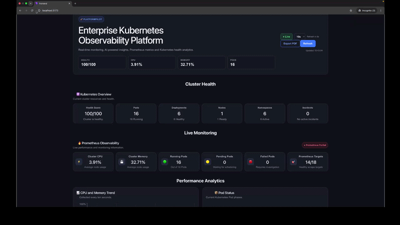

# 🚀 PlatformPilot

> **An AI-assisted Kubernetes Observability Platform for monitoring cluster health, analyzing workloads, and accelerating incident response.**

PlatformPilot combines Kubernetes APIs, Prometheus metrics, and AI-powered operational insights into a modern dashboard designed for Platform Engineers, DevOps Engineers, and Site Reliability Engineers.

---

## 🎥 Demo

<p align="center">
  
</p>

---


---

# 📖 Overview

PlatformPilot is a modern Kubernetes observability platform that provides real-time visibility into cluster resources, infrastructure health, workloads, and performance metrics.

Built with **React**, **FastAPI**, and the **Kubernetes Python Client**, the platform combines operational dashboards with AI-powered insights to help engineers detect issues, investigate workloads, and make faster operational decisions.

---

# ✨ Key Features

### 📊 Cluster Observability

- Kubernetes Health Dashboard
- Live Cluster Monitoring
- Health Scoring
- Prometheus Metrics
- Performance Analytics
- Manual & Auto Refresh
- PDF Report Export

### 🤖 AI Operations

- AI Operations Summary
- Root Cause Analysis
- Cluster Health Assessment
- Severity Classification
- Operational Recommendations
- Incident Detection

### 🔍 Productivity

- Global Kubernetes Search
- Command Palette (Ctrl+K / ⌘K)
- Keyboard Navigation
- Instant Resource Discovery
- Search Pods, Deployments, Nodes & Namespaces

### 📈 Infrastructure Monitoring

- Pods
- Deployments
- Nodes
- Namespaces
- Live Kubernetes Events
- Container Logs
- Resource Health Monitoring

---

# 🏗 Architecture

```text
                    React + Vite
                          │
                          ▼
                    FastAPI Backend
                REST API Endpoints
                          │
        ┌─────────────────┴─────────────────┐
        ▼                                   ▼
 Kubernetes Python Client         Prometheus HTTP API
        │                                   │
        └─────────────────┬─────────────────┘
                          ▼
                  Kubernetes Cluster
```

For a detailed architecture walkthrough, see **docs/ARCHITECTURE.md**.

---

# 🛠 Technology Stack

| Layer | Technology |
|--------|------------|
| Frontend | React 19, React Router, Vite, CSS3 |
| Backend | FastAPI, Python 3.12, Uvicorn |
| Kubernetes | Kubernetes Python Client |
| Monitoring | Prometheus |
| Infrastructure | Docker Desktop Kubernetes, kubectl |

---

# 📸 Screenshots

## 📊 Dashboard Overview

The central dashboard provides cluster health, workload statistics, AI insights, and live monitoring.


---

## 🔍 Global Search

Search Kubernetes resources instantly across Pods, Deployments, Nodes, and Namespaces.


---

## ⌨️ Command Palette

Navigate the platform using keyboard shortcuts with **Ctrl+K / ⌘K**.


---

## 📈 Performance Analytics

Monitor CPU, memory, pod distribution, and namespace utilization using Prometheus-powered analytics.


---

## 🤖 AI Operations Summary

Receive AI-generated operational insights, health analysis, findings, and recommended actions.


---

## 🚨 Incident Center

Track operational alerts and cluster incidents from a centralized dashboard.


---

# 🌟 Project Overview

This infographic summarizes PlatformPilot's architecture, roadmap, repository highlights, and future vision.


---

# 📂 Project Structure

```text
platform-pilot/
│
├── backend/
├── frontend/
├── infrastructure/
├── screenshots/
├── docs/
│   └── ARCHITECTURE.md
│
├── CHANGELOG.md
├── ROADMAP.md
├── CONTRIBUTING.md
├── LICENSE
└── README.md
```

---

# 🚀 Getting Started

## Clone the Repository

```bash
git clone https://github.com/AZ1600/platform-pilot.git

cd platform-pilot
```

---

## Backend

```bash
cd backend

python -m venv venv

# macOS / Linux
source venv/bin/activate

# Windows
venv\Scripts\activate

pip install -r requirements.txt

uvicorn app:app --reload
```

Backend:

```
http://localhost:8000
```

---

## Frontend

```bash
cd frontend

npm install

npm run dev
```

Frontend:

```
http://localhost:5173
```

---

# 🗺 Roadmap

## ✅ Completed

- Kubernetes Dashboard
- AI Operations Summary
- Global Search
- Command Palette
- Performance Analytics
- Prometheus Integration
- Incident Center
- PDF Export
- Auto Refresh
- Responsive UI

### 🚀 Coming Next

- Authentication
- RBAC
- Multi-cluster Support
- Historical Metrics
- WebSocket Live Updates
- Grafana Integration
- Helm Monitoring
- LLM-powered Root Cause Analysis

See **ROADMAP.md** for more details.

---

# 💡 Use Cases

PlatformPilot helps Platform Engineers, DevOps Engineers, and SREs to:

- Monitor Kubernetes cluster health
- Investigate unhealthy workloads
- Search Kubernetes resources instantly
- Analyze Prometheus metrics
- Detect operational incidents
- Review container logs
- Troubleshoot deployments
- Accelerate incident response using AI

---

# 🤝 Contributing

Contributions are welcome!

Please read **CONTRIBUTING.md** before opening a pull request.

---

# 📄 License

This project is licensed under the MIT License.

---

# 👨‍💻 Author

**Olawale Azeez**

GitHub: https://github.com/AZ1600

---

<p align="center">

⭐ If you found PlatformPilot useful, please consider giving the repository a star!

</p>