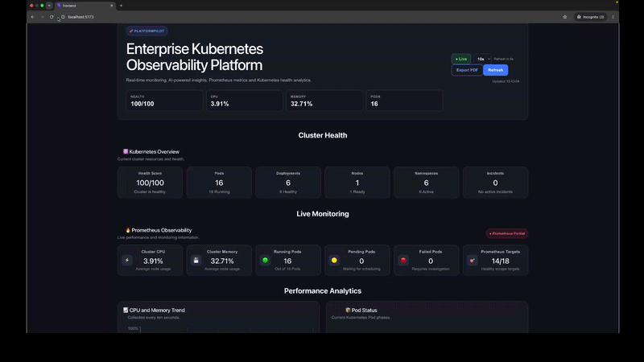
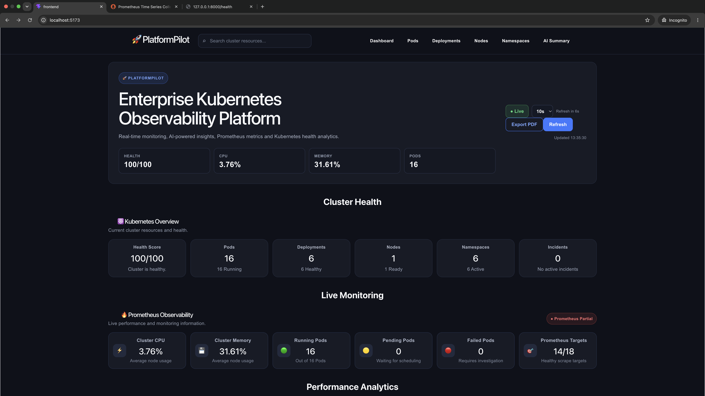
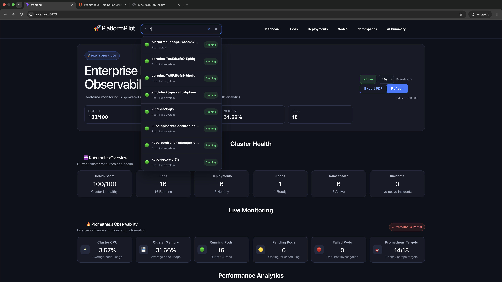
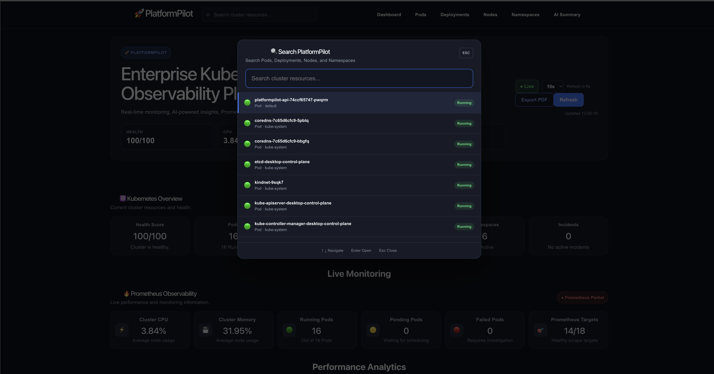
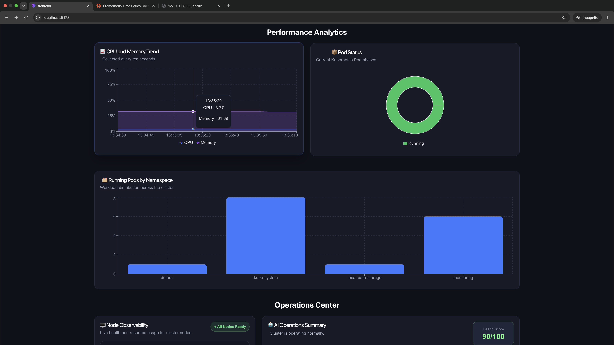
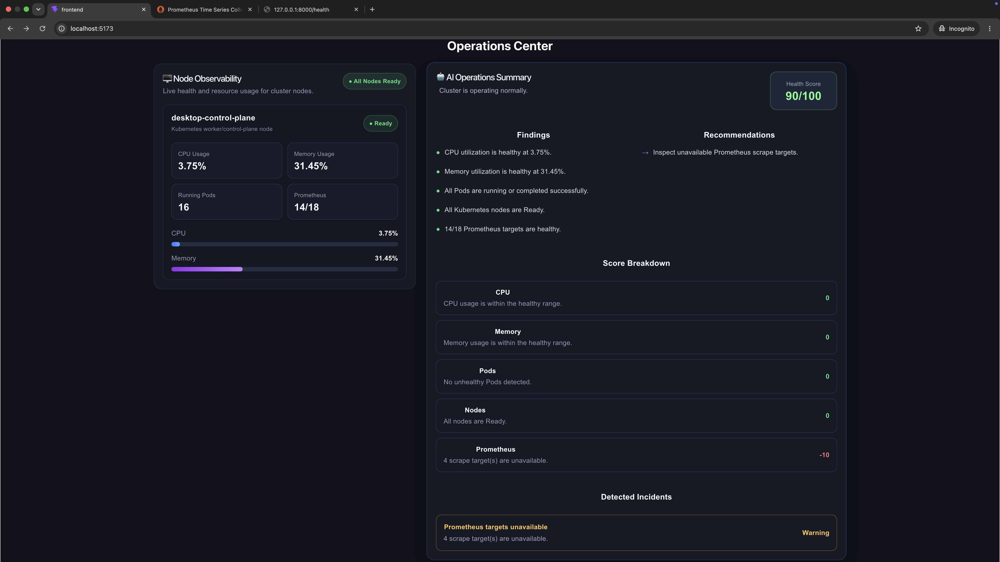
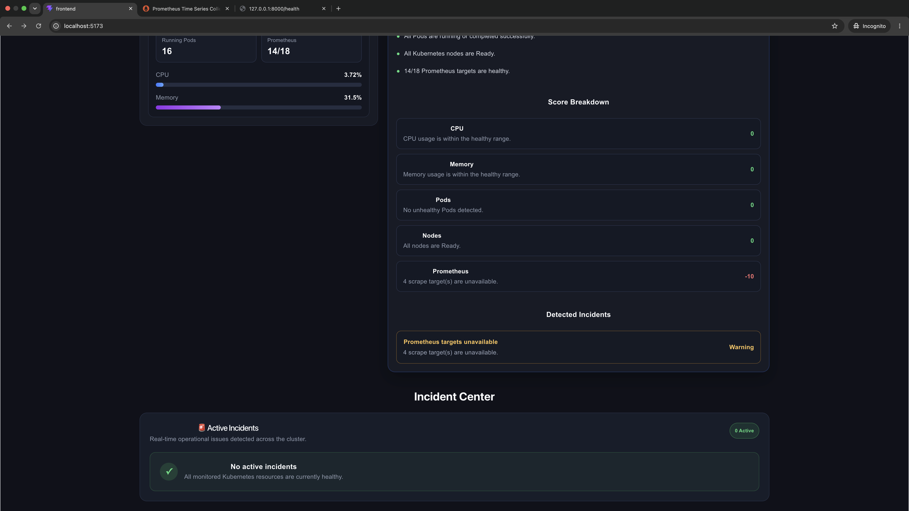
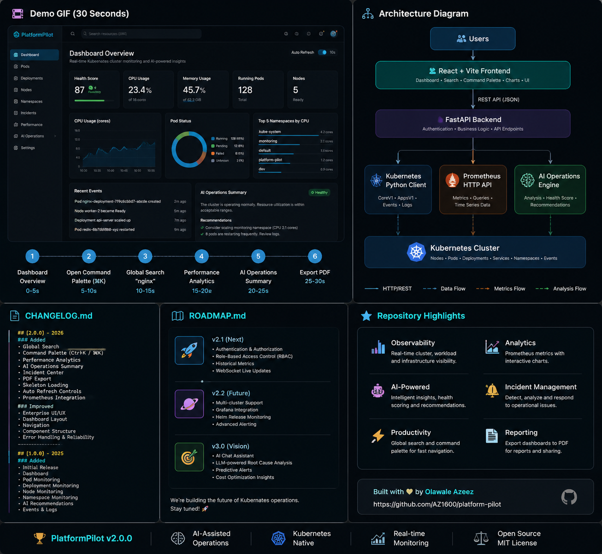

# 🚀 PlatformPilot

> **An AI-assisted Kubernetes Observability Platform for monitoring cluster health, analyzing workloads, and accelerating incident response.**

PlatformPilot combines Kubernetes APIs, Prometheus metrics, operational analysis, and AI-assisted insights into a modern dashboard designed for Platform Engineers, DevOps Engineers, and Site Reliability Engineers.

---

## 🎥 Demo

<p align="center">
  
</p>

---


---

# 📖 Overview

PlatformPilot is a Kubernetes observability platform that provides visibility into cluster resources, infrastructure health, workloads, Prometheus metrics, incidents, and operational findings.

Built with **React**, **FastAPI**, the **Kubernetes Python Client**, and **Prometheus**, the platform combines operational dashboards with analysis workflows that help engineers detect issues, investigate workloads, and make faster operational decisions.

PlatformPilot can also export structured operational findings to CloudOps Command Center for approval-gated operational workflows.

---

# ✨ Key Features

### 📊 Cluster Observability

- Kubernetes Health Dashboard
- Live Cluster Monitoring
- Health Scoring
- Prometheus Metrics
- Performance Analytics
- Manual and Auto Refresh
- PDF Report Export

### 🤖 AI-Assisted Operations

- Operations Summary
- Root Cause Analysis Support
- Cluster Health Assessment
- Severity Classification
- Operational Recommendations
- Incident Detection

### 🔍 Productivity

- Global Kubernetes Search
- Command Palette with Ctrl+K / ⌘K
- Keyboard Navigation
- Instant Resource Discovery
- Search Pods, Deployments, Nodes, and Namespaces

### 📈 Infrastructure Monitoring

- Pods
- Deployments
- Nodes
- Namespaces
- Kubernetes Events
- Container Logs
- Resource Health Monitoring

### 🔗 CloudOps Integration

- Structured operational finding generation
- Authenticated delivery to CloudOps Command Center
- Environment and cluster metadata
- Unique finding identifiers
- Contract-driven incident export

---

# 🏗 Architecture

```text
                         React + Vite
                              │
                              ▼
                       FastAPI Backend
                      REST API Endpoints
                              │
          ┌───────────────────┼───────────────────┐
          ▼                   ▼                   ▼
 Kubernetes Python      Prometheus HTTP      Operational
      Client                  API              Analysis
          │                   │                   │
          └───────────────────┼───────────────────┘
                              ▼
                      Kubernetes Cluster
                              │
                              ▼
                    Operational Findings
                              │
                              ▼
                 CloudOps Command Center
```

For a detailed architecture walkthrough, see `docs/ARCHITECTURE.md`.

---

# 🔐 API Security

PlatformPilot includes role-scoped bearer-token authentication for sensitive operational actions.

The current authorization model defines three roles:

- `viewer` — read-oriented role reserved for future protected API access
- `operator` — permitted to trigger operational actions such as CloudOps finding export
- `admin` — includes operator privileges and provides an administrative role for future controls

The sensitive endpoint:

```text
POST /cloudops/findings
```

requires at least the `operator` role.

Authentication fails closed:

- missing API authentication configuration returns `503`
- missing or invalid bearer credentials return `401`
- authenticated users without sufficient permission receive `403`
- `operator` and `admin` roles are permitted to perform CloudOps exports

Bearer-token values are compared using constant-time comparison.

Configure authentication through environment variables:

```bash
export PLATFORM_VIEWER_TOKEN="replace-with-long-random-token"
export PLATFORM_OPERATOR_TOKEN="replace-with-long-random-token"
export PLATFORM_ADMIN_TOKEN="replace-with-long-random-token"
```

This is currently **API-level authentication for sensitive backend operations**.

It is not yet:

- full end-user login
- browser session authentication
- SSO
- identity-provider integration
- application-wide RBAC

See `backend/.env.example` for the configuration template.

---

# 🔗 CloudOps Security Boundary

PlatformPilot and CloudOps use separate authentication boundaries.

### Calling PlatformPilot

A caller requesting an operational export must authenticate to PlatformPilot with a role-scoped PlatformPilot bearer token.

```text
Caller
  │
  │ PlatformPilot operator/admin token
  ▼
POST /cloudops/findings
```

### PlatformPilot Calling CloudOps

After authorization succeeds, PlatformPilot authenticates its outbound request to CloudOps using:

```text
CLOUDOPS_INGEST_TOKEN
```

```text
PlatformPilot
  │
  │ CloudOps ingest token
  ▼
CloudOps Command Center
```

This separation avoids reusing the same credential across both trust boundaries.

---

# 🧪 Validation

The backend security and integration layers are covered by automated tests.

Current backend verification:

```text
31 tests passed
```

The test suite covers:

- CloudOps export services
- CloudOps route behavior
- CloudOps delivery failures
- configuration handling
- operational finding generation
- Kubernetes pod routes
- bearer-token authentication
- role mapping
- viewer authorization rejection
- operator authorization
- admin authorization
- HTTP-level `401`, `403`, and successful authorization paths

The frontend is also validated with:

```bash
npm run lint
npm run build
```

GitHub Actions runs backend tests and frontend checks on pull requests and pushes to `main`.

---

# 🛠 Technology Stack

| Layer | Technology |
|---|---|
| Frontend | React 19, React Router, Vite, CSS3 |
| Backend | FastAPI, Python 3.11, Uvicorn |
| Kubernetes | Kubernetes Python Client |
| Monitoring | Prometheus |
| Security | Bearer-token authentication, role-based authorization |
| Integration | CloudOps operational finding API |
| Testing | Pytest, FastAPI TestClient, HTTPX |
| CI | GitHub Actions |
| Infrastructure | Docker, Kubernetes, kubectl |

---

# 📸 Screenshots

## 📊 Dashboard Overview

The central dashboard provides cluster health, workload statistics, operational insights, and live monitoring.



---

## 🔍 Global Search

Search Kubernetes resources across Pods, Deployments, Nodes, and Namespaces.



---

## ⌨️ Command Palette

Navigate the platform using keyboard shortcuts with **Ctrl+K / ⌘K**.



---

## 📈 Performance Analytics

Monitor CPU, memory, pod distribution, and namespace utilization using Prometheus-powered analytics.



---

## 🤖 AI Operations Summary

Review operational insights, health analysis, findings, incidents, and recommended actions.



---

## 🚨 Incident Center

Track operational alerts and Kubernetes incidents from a centralized dashboard.



---

# 🌟 Project Overview

This infographic summarizes PlatformPilot's architecture, roadmap, repository highlights, and platform-engineering focus.



---

# 📂 Project Structure

```text
platform-pilot/
│
├── backend/
│   ├── core/
│   │   ├── config.py
│   │   └── security.py
│   ├── routers/
│   ├── services/
│   ├── tests/
│   ├── .env.example
│   ├── Dockerfile
│   ├── requirements.txt
│   └── requirements-dev.txt
│
├── frontend/
│   ├── src/
│   │   ├── pages/
│   │   └── services/
│   ├── package.json
│   └── vite.config.js
│
├── infrastructure/
│   ├── backend-deployment.yaml
│   ├── backend-service.yaml
│   └── monitoring-values-docker-desktop.yaml
│
├── docs/
├── screenshots/
├── .github/
│   └── workflows/
│       └── ci.yml
│
├── CHANGELOG.md
├── CONTRIBUTING.md
├── LICENSE
├── pytest.ini
└── README.md
```

---

# 🚀 Getting Started

## Clone the Repository

```bash
git clone https://github.com/AZ1600/platform-pilot.git

cd platform-pilot
```

---

## Backend

Create and activate a Python virtual environment:

```bash
python3 -m venv .venv

source .venv/bin/activate
```

Install backend dependencies:

```bash
python -m pip install -r backend/requirements.txt
```

For development and testing:

```bash
python -m pip install -r backend/requirements-dev.txt
```

Start the backend:

```bash
cd backend

uvicorn app:app --reload
```

Backend API:

```text
http://localhost:8000
```

Health endpoint:

```text
http://localhost:8000/health
```

---

# 🔑 Backend Environment Configuration

A configuration template is available at:

```text
backend/.env.example
```

Example values:

```bash
PLATFORM_VIEWER_TOKEN=replace-with-viewer-token
PLATFORM_OPERATOR_TOKEN=replace-with-operator-token
PLATFORM_ADMIN_TOKEN=replace-with-admin-token

CLOUDOPS_INGEST_TOKEN=replace-with-cloudops-ingest-token
CLOUDOPS_FINDINGS_URL=http://127.0.0.1:3000/api/platform-pilot/findings

PLATFORM_ENVIRONMENT=local
KUBERNETES_CLUSTER_NAME=docker-desktop
```

Use long randomly generated values for real tokens.

Never commit production credentials to the repository.

---

# 🖥 Frontend

```bash
cd frontend

cp .env.example .env

npm install

npm run dev
```

The frontend uses:

```text
http://127.0.0.1:8000
```

by default.

To use a backend at a different address, configure:

```text
VITE_API_URL
```

inside `frontend/.env`.

Frontend:

```text
http://localhost:5173
```

---

# 🧪 Running Tests

From the repository root with the Python virtual environment active:

```bash
python -m pytest
```

Current validated baseline:

```text
31 passed
```

Frontend validation:

```bash
cd frontend

npm run lint
npm run build
```

---

# 🔄 CI Pipeline

GitHub Actions validates both backend and frontend changes.

### Backend

```text
Install Python dependencies
        ↓
Run Pytest
```

### Frontend

```text
Install Node dependencies
        ↓
ESLint
        ↓
Production Vite build
```

The workflow uses read-only repository permissions and runs on pull requests and pushes to `main`.

---

# 🗺 Roadmap

## ✅ Completed

- Kubernetes Dashboard
- Kubernetes Resource Monitoring
- Cluster Health Scoring
- Prometheus Integration
- Performance Analytics
- Operational Summary
- Global Search
- Command Palette
- Incident Center
- Container Log Inspection
- PDF Export
- Auto Refresh
- Responsive UI
- CloudOps Operational Finding Export
- Authenticated CloudOps Delivery
- Role-Scoped Authentication for Sensitive API Operations
- Operator and Admin Authorization Boundary
- Backend Security Tests
- CI Validation

### 🚀 Coming Next

- Broader endpoint RBAC
- End-user authentication / SSO
- Multi-cluster Support
- Historical Metrics
- WebSocket Live Updates
- Grafana Integration
- Helm Monitoring
- Expanded LLM-assisted Root Cause Analysis
- Frontend dependency security remediation
- Frontend bundle code splitting

---

# 💡 Use Cases

PlatformPilot helps Platform Engineers, DevOps Engineers, and SREs:

- monitor Kubernetes cluster health
- investigate unhealthy workloads
- search Kubernetes resources
- analyze Prometheus metrics
- detect operational incidents
- review container logs
- troubleshoot deployments
- generate structured operational findings
- export incidents into controlled CloudOps workflows
- accelerate incident investigation and response

---

# 🔒 Security Notes

PlatformPilot follows a fail-closed approach for protected operational actions.

No application tokens are stored in source code.

Environment variables are used for:

```text
PLATFORM_VIEWER_TOKEN
PLATFORM_OPERATOR_TOKEN
PLATFORM_ADMIN_TOKEN
CLOUDOPS_INGEST_TOKEN
```

The current role hierarchy is:

```text
viewer
   │
   ▼
operator
   │
   ▼
admin
```

Higher roles inherit the permissions of lower roles.

Authentication and authorization are intentionally implemented as a focused API security boundary today, with broader identity and access management planned for future releases.

---

# 🤝 Contributing

Contributions are welcome.

Please read `CONTRIBUTING.md` before opening a pull request.

---

# 📄 License

This project is licensed under the MIT License.

---

# 👨‍💻 Author

**Olawale Azeez**

GitHub: https://github.com/AZ1600

---

<p align="center">

⭐ If you found PlatformPilot useful, please consider giving the repository a star!

</p>